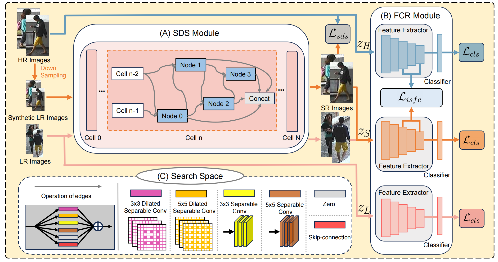

# Semantic-Aware Detail Search and Feature Constraints for Cross-Resolution Person Re-Identification



## Requirements

we use single RTX4090 24G GPU for training and evaluation. 

```
pytorch 2.0.0
torchvision 0.15.1
h5py
scipy
imageio
graphviz
```

## Training

```python
python train.py \
--DATASET Market-1501 \
--BATCH_SIZE 32 \
--MAX_EPOCHS 200
```

## Testing

```python
python test.py
```

